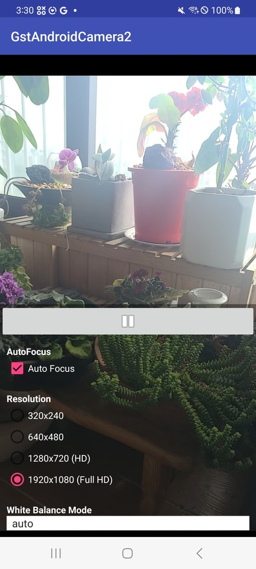

gst-ahc2 — GStreamer Android Camera2 NDK plugin
================================================

A GStreamer source/sink plugin pair that wraps the **Android Camera2 NDK API**,
plus zero-copy GL preview using AHardwareBuffer + EGLImage.
Includes a demo Android application showing live camera preview through a
GStreamer pipeline.

> This project is a Camera2 NDK port and rewrite of
> [gst-android-camera](https://github.com/gstreamer101/gst-android-camera)
> (originally the `ahcsrc` element, Camera1-based) by Justin Kim and
> Youness Alaoui (Collabora Ltd., 2012–2017). The original plugin uses the
> deprecated `android.hardware.Camera` (Camera1) Java API.
> `gst-ahc2` is reimplemented on top of `<camera/NdkCameraDevice.h>`
> (Camera2 NDK) and adds zero-copy GL preview via AHardwareBuffer.


Plugins / Elements
------------------

| Element     | Type   | Description |
|-------------|--------|-------------|
| `ahc2src`   | source | Captures frames from the Android Camera2 NDK. Produces `video/x-raw(memory:GLMemory)` (RGBA, zero-copy GL path) or `video/x-raw` (NV12, software fallback path). |
| `ahc2sink`  | sink   | Renders frames into an `ANativeWindow` (Android Surface). Provided as a standalone sink; the demo app uses `glimagesink` paired with the GL zero-copy path. |

Internal supporting components:

- **`GstAhc2HwbPool`** — `GstBufferPool` backed by `AHardwareBuffer`; recycles
  capture buffers and integrates with the GL allocator.
- **`GstAhc2HwbAllocator`** — `GstAllocator` wrapping `AImage` /
  `AHardwareBuffer` lifetime.
- **GL zero-copy bridge** — wraps each captured `AHardwareBuffer` as a
  `GstEGLImage` via `eglGetNativeClientBufferANDROID`, then exposes it as a
  `GL_TEXTURE_EXTERNAL_OES` `GstGLMemory` for downstream GL elements.

Example pipeline used by the demo app:

```
ahc2src ! capsfilter caps=video/x-raw(memory:GLMemory),format=RGBA ! glimagesink
```


Demo App Features
-----------------

The included demo app (`org.freedesktop.gstreamer.examples.camera`) shows a
fullscreen live camera preview running through the GStreamer pipeline above.

**Tap the screen** once to open the control menus:

| Menu | Options | Note |
|------|---------|------|
| Resolution | `320x240`, `640x480`, `1280x720 (HD)`, `1920x1080 (Full HD)` | Triggers `gst_native_change_resolution` which updates the capsfilter to keep the GL zero-copy path on every resolution. |
| White Balance | Auto / Daylight / Cloudy / Twilight / Incandescent / Fluorescent / Warm Fluorescent / Shade | Routed through `GST_PHOTOGRAPHY_PROP_WB_MODE` on `ahc2src`. |
| Autofocus | On / Off | Routed through `gst_photography_set_autofocus` on `ahc2src`. |

> The initial preview resolution is whatever the device's Camera2 HAL +
> `glimagesink` happen to negotiate (typically the camera's native preview mode,
> e.g. 1920x824 on Galaxy S20+ FE). Tap a resolution radio button to switch
> explicitly. The capsfilter caps include `format=RGBA` and the
> `memory:GLMemory` feature, so resolution changes preserve the GL zero-copy
> path and do not introduce color-space conversion artifacts.


Prerequisite
------------

- GStreamer SDK for Android (>= 1.26.1)
- Android Studio (>= 2024.3.1)
- Android NDK (>= r25c)
- Gradle (>= 8.11.1)
- Android device with API level 26+ (Android 8.0 Oreo or later) — required by
  the Camera2 NDK
- `android.permission.CAMERA` granted at runtime


Tested Environment
------------------

The following exact versions are known-good and used for the build / testing
shown in the screenshot below.

| Component | Version |
|-----------|---------|
| **Host OS** | Linux 6.8 (Ubuntu) |
| **Android Studio** | 2025.2.3 (`/opt/android-studio-2025.2.3`) |
| **JDK** | OpenJDK 21.0.8 — Android Studio bundled JBR (`$ANDROID_STUDIO/jbr`) |
| **Gradle wrapper** | 8.11.1 |
| **Android Gradle Plugin** | 8.9.1 |
| **Android SDK (`compileSdk`)** | 33 (Android 13) |
| **`minSdk` / `targetSdk`** | 26 / 33 |
| **Android NDK** | 25.2.9519653 (r25c) |
| **GStreamer Android SDK** | 1.26.1 (Universal) |
| **Test device** | Samsung Galaxy S20+ FE (SM-G986N), Android 13 (API 33), arm64-v8a |
| **`applicationId`** | `org.freedesktop.gstreamer.examples.camera` |
| **App label** | `GstAndroidCamera2` |


Build and Installation with terminal
------------------------------------

- Download GStreamer
  Go to: https://gstreamer.freedesktop.org/download/
  Download the Android Universal 1.26.1 tarball, and extract it to a desired
  location.

- Set the `GSTREAMER_ROOT_ANDROID` environment variable (or use the
  `gstAndroidRoot` property in `gradle.properties`)
```
  $ export GSTREAMER_ROOT_ANDROID=/path/to/gstreamer/sdk
```

- Set `JAVA_HOME` to a JDK 21 (Android Studio's bundled JBR works)
```
  $ export JAVA_HOME=/opt/android-studio-2025.2.3/android-studio/jbr
```

- Create `local.properties` and add the `sdk.dir` property

- Build with gradle
```
  $ ./gradlew build
```

- Install on a connected device
```
  $ ./gradlew installDebug
```

- Launch the demo app
```
  $ adb shell monkey -p org.freedesktop.gstreamer.examples.camera \
      -c android.intent.category.LAUNCHER 1
```

Detailed step-by-step build/run/log instructions are in
[BUILD_AND_DEPLOY.md](BUILD_AND_DEPLOY.md).


Build and Installation with Android Studio
------------------------------------------

- Set `GSTREAMER_ROOT_ANDROID`. Two options:

  * As an environment variable in the Run Configuration:
    Run > Edit Configurations > + > Gradle > Environment variables, add:
    `GSTREAMER_ROOT_ANDROID=/your/path`

  * Or set `gstAndroidRoot` in `gradle.properties`:
    ```
    gstAndroidRoot=/your_gstreamer_path/gstreamer/1.26.1
    ```

- Sync Gradle

- Click the "Run 'app'" button to build and install the demo app on the
  selected device.


Project Layout
--------------

```
app/src/main/
├── AndroidManifest.xml
├── java/org/freedesktop/gstreamer/
│   ├── GStreamer.java                       # GStreamer SDK init helper
│   ├── camera/
│   │   ├── CameraActivity.java              # main activity, UI handlers
│   │   └── GstAhc.java                      # JNI bridge (Java side)
│   └── androidmedia/                        # Camera1 callback shims (legacy)
├── jni/
│   ├── android_camera.c                     # JNI implementation, pipeline setup
│   ├── Android.mk
│   ├── Application.mk
│   ├── ahc2src/                             # ahc2src plugin
│   │   ├── gstahc2src.c / .h                # GstBaseSrc subclass
│   │   ├── gstahc2hwbpool.c / .h            # AHardwareBuffer-backed buffer pool
│   │   ├── gstahc2hwballocator.c            # AImage/AHB allocator
│   │   ├── gstahc2hwbmemory.h
│   │   └── plugin.c                         # GST_PLUGIN_DEFINE
│   ├── ahc2sink/                            # ahc2sink plugin
│   │   ├── gstahc2sink.c / .h               # ANativeWindow sink
│   │   ├── gstahc2sinkbypass.c / .h         # surface-bypass meta + GstContext
│   │   └── plugin.c
│   └── common/
│       └── gstahc2protocol.h                # GstContext / caps feature names
└── res/
    ├── layout/                              # activity_main.xml, resolution.xml,
    │                                        # white_balance.xml, autofocus.xml
    └── values/                              # strings, colors, styles
```


Debugging — Zero-copy verification
----------------------------------

To verify that camera frames really are flowing without copies through the
chain `dma_buf → AHardwareBuffer → AImage → GstBuffer`, see the standalone
guide:

> [`../ZERO_COPY_DEBUGGING_GUIDE.md`](../ZERO_COPY_DEBUGGING_GUIDE.md)

It walks through 4 LLDB breakpoints in `gstahc2src.c` and
`gstahc2hwballocator.c` that let you confirm the same `AHardwareBuffer *`
pointer is shared across the entire chain — proving zero-copy at runtime.

For richer evidence (actual `dma_buf` fd inode), the same guide includes
a helper using `AHardwareBuffer_sendHandleToUnixSocket`.


Screenshots
-----------



> Captured on Samsung Galaxy S20+ FE (SM-G986N, Android 13). The radio button
> shows `1920x1080 (Full HD)` selected, and the live preview is rendered
> through the `ahc2src ! glimagesink` GL zero-copy path.


Limitations and Known issues
----------------------------

- `ahc2src` is a `GstPushSrc` subclass, so it is not directly compatible with
  `camerabin2`.
- Resolution / pixel format selection is driven by negotiated caps via
  `capsfilter`. The set of supported configurations depends on the device's
  Camera2 capabilities; query them at runtime from the application side.
- The plugin currently caps the maximum advertised resolution at **1920 in
  both dimensions** (see `gst_ahc2_src_get_caps` in `gstahc2src.c`). Bump or
  remove this if you need 4K capture.
- Initial preview resolution is whatever caps negotiation chooses; the demo
  app's resolution radio buttons (320 / 640 / 1280 / 1920) are not always
  what the camera starts at. Tap one explicitly to switch.
- `ahc2sink` is provided as a standalone sink element but the demo app uses
  `glimagesink` paired with the GL zero-copy path of `ahc2src`.
- Android API 26+ is required because the Camera2 NDK
  (`<camera/NdkCameraDevice.h>`) was added in API 24/26 and the AHardwareBuffer
  + EGL bridge requires that level.


License
-------

This project is licensed under the **GNU Lesser General Public License v2.1
(LGPL-2.1)**. See [LICENSE](LICENSE) for the full license text.

The project is derived from
[gst-android-camera](https://github.com/gstreamer101/gst-android-camera)
(LGPL-2.1) by Justin Kim and Youness Alaoui (Collabora Ltd., 2012–2017).
The Camera2 NDK plugins (`ahc2src`, `ahc2sink`), the AHardwareBuffer-based
buffer pool / allocator, and the zero-copy GL path are new work written by
KIMRIHYEON (2026).

When redistributing, you must comply with LGPL-2.1: keep the original and
derived copyright notices, mark modifications, and provide source on request.


Authors
-------

- **KIMRIHYEON** <dlgus8648@naver.com> — Camera2 NDK port, `ahc2src` /
  `ahc2sink` plugins, zero-copy GL path (2026)
- **Justin Kim** <justin.kim@collabora.com>, Collabora Ltd. — original
  `ahcsrc` (Camera1) plugin and example app (2016–2017)
- **Youness Alaoui**, Collabora Ltd. — original example app scaffolding (2012)
